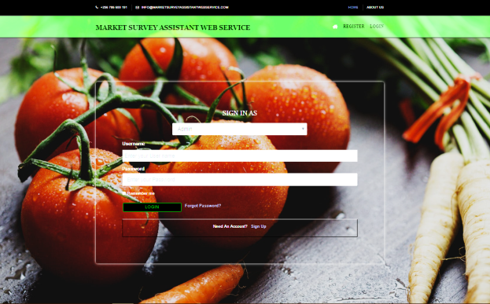
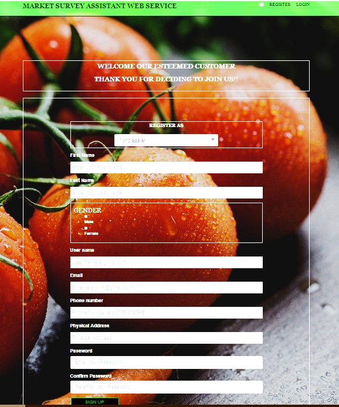
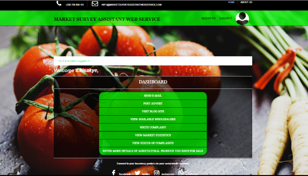

# MWAS

***

## Table of contents
- [Previews](#previews)
- [Description](#description)
- [Components](#components)
- [Usage](#usage)
- [Issues](#issues)
- [Authors](#authors)

## Previews
> 
>
> 
>
>
>

## Description
This project was designed to help Ugandan farmers expand their customer bases and profit margins.

## Components
For this project, I decided to use the following technologies to prototype this solution.
Front-end: Vue js material design framework.
Backend: Flask a lightweight web application framework.
Database: Mysql
Vue js is an open source frontend javascript framework for building user interfaces and single-page applications.
Flask is a web based framework that uses python and implemented on werkzueg and jinja2 designed for the server-side of an application.

## Usage
### Prerequisites
- Ensure you have python3 installed version above #3.4#
- Clone the project from this repo
- Install the necessary python3 modules as per the requirements.txt
- set the following environment variables(use .env or set in command line)
    - `SECRET_KEY` - for generating tokens
    - `DB_URI` - sqlite3, mysql or postgress server dailect
    - `ENVIRONMENT`(optional) - defaults to 'development'
    - `PORT`(optional) - defaults to 8000
- run `python3 run.py` to run the server

## Current Issues
- The market stats are not yet fully working fine 
- Need to get Googple Charts new API key to get the functionality working.

## Contribution
Contributions are always welcome! Please read the [contribution guidelines](./contribution.md) first.

## Authors
Byenkya Joshua Aaron - [Github](https://github.com/Byenkya)
